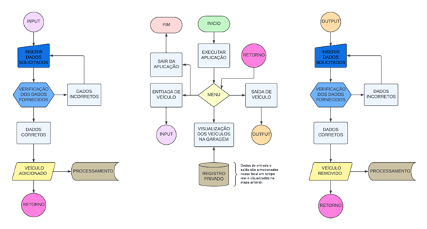

 
  

<h1 align="center">Desenvolvimento de Sitesma para Manipulação de Dados</h1>

<h3 align="center">Trabalho para conclusão semestral da disciplina de Orientação a Objetos com JAVA</h3>

  

  

  
 

  <a href="#dart-sobre">Sobre</a> &#xa0; | &#xa0; 
  <a href="#memo-licença">Licença</a> &#xa0; | &#xa0;
  <a href="https://github.com/isabellazramos" target="_blank">Autor</a>

<h2 align='center'>  :dart: Sobre </h2>

  Trabalho de conclusão de semestre sobre a persistência de dados, visando contribuir para o avanço do conhecimento em paradigmas orientados a objetos, bem como destacando a importância do armazenamento de dados para garantir a continuidade e viabilizar futuras manipulações do programa pelos usuários.

<h2 align='center'>📽️ Projeto</h2>

Detalhamento do projeto com o uso de diagrama UML:

    
 

<h2 align="center" > 🏗️ Estrutura </h2>

  
 <h3> Processo de acesso aos dados </h3> 

 
A Classe `LerGaragemCSV`  é onde está todo o método utilizado para ler e retornar os dados presentes no csv, são eles: 
 
O método `pegaCsv(String file)` lê o conteúdo de um arquivo CSV e retorna os dados como uma única string. Ele primeiro abre o arquivo especificado usando um `FileInputStream` e, em seguida, usa um `InputStreamReader` com codificação UTF-8 para lê-lo como texto. O método cria um `BufferReader ` para facilitar a leitura da linha. Enquanto o arquivo CSV tiver linha, o método lê e adiciona a linha à variável de string criada, separando cada linha por um ponto e vírgula (;) entre elas. Caso ocorra uma exceção de E/S(IOException), o método imprimirá “erro pegaCsv”. Finalmente, a string de concatenação com o arquivo CSV é retornada. 

O método `guardarCarro(Carro aCar, String filePath)` adiciona uma nova entrada de carro no final do arquivo CSV. Ele abre o arquivo em modo de anexação utilizando um `FileWriter` com o parâmetro `true`, permitindo adicionar dados sem sobrescrever o conteúdo já existente. Esse `FileWriter` é envolvido em um `BufferedWriter` para melhorar a eficiência da escrita, e um `PrintWriter` é usado para facilitar a formatação da saída. Os dados do carro (ano, marca, modelo e placa) são então escritos no arquivo CSV, separados por vírgulas para que não ocorra erros, caso ocorra, uma exceção de E/S (IOException) acontecerá e o método simplesmente imprime uma linha em branco. 

O método `removerCar(String filePath, String aGaragem)` reescreve o arquivo CSV sem a entrada do carro especificado, passando a ideia de que o carro foi removido. Ele abre o arquivo em modo de escrita utilizando um `FileOutputStream`, o que sobrescreve todo o conteúdo existente. O `FileOutputStream` é envolvido em um `OutputStreamWriter` com codificação UTF-8, e um `PrintWriter` é criado para facilitar a escrita no arquivo. A string `aGaragem` é dividida em um array de strings utilizando o delimitador `;`, e o método itera sobre este array, escrevendo cada linha no arquivo CSV. Em caso de uma exceção de E/S (IOException), o método imprime "Erro na removerCar". 

Resumindo, o método `pegaCsv` lê o conteúdo de um arquivo CSV e retorna uma string com todas as linhas associadas e separadas por ponto e vírgula. O método `saveCar` adiciona uma nova linha contendo os dados do carro ao final do arquivo CSV. O método `removeCar` substitui o arquivo CSV sem especificar uma linha, sem o carro especificado removendo efetivamente o carro. Esses métodos usam estruturas de controle e fluxos de E/S para executar operações comuns em arquivos CSV e usam tratamento básico de exceções para lidar com erros de E/S.

  
  <h3> Processo de visualização dos dados </h3> 

A classe chamada `Menu` é responsável por gerenciar a exibição de opções e informações para os usuários. Seus métodos oferecem funcionalidades para apresentar títulos, diferentes menus e limpar o terminal, organizando a interação do usuário de forma clara e intuitiva. 

O método `title()` exibe o título principal de forma centralizada, utilizando um separador para destacá-lo. 

Por meio do método `menu()`, diferentes menus são apresentados conforme cada uma das opções fornecidas. Por exemplo, para a remoção de veículos, são dadas instruções sobre o formato da placa e um prompt para inserir a placa do veículo a ser retirado. Da mesma forma, o método trata outras opções, como visualizar os carros na garagem ou adicionar outro veículo, fornecendo orientações para cada uma das ações. 

O método `LimparTerminal()` limpa o terminal para uma melhor experiência visual. Em resumo, a classe Menu facilita a interação do usuário com o sistema de gerenciamento da garagem, fornecendo uma interface organizada e intuitiva para conseguir acessar as diferentes funcionalidades do aplicativo.
 

<h2 align="center" > :memo: Licença</h2>

Este projeto está sob licença MIT. Veja o arquivo [LICENSE](LICENSE.md) para mais detalhes.

Feito com :heart: por <a href="https://github.com/Mathbull" target="_blank">Matheus Santos</a>

&#xa0;

<a href="#top">Voltar para o topo</a>
